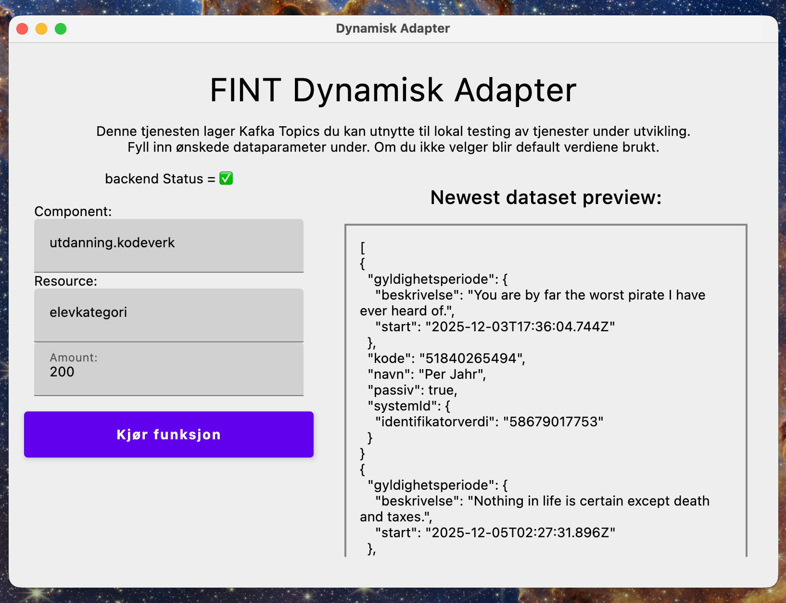

# **DYNA: Dynamisk Adapter**

En tjeneste til å dekke ønsket om relevant mock-data for oss utviklere som jobber med FINT
informasjonsmodellen.

### Nåværende status:

- Grunnfunksjonalitet fungerer veldig bra, og kan [implimenteres i tjenester og tester](#core-lib-data-generering).

- Prosjektet kan kjøres lokalt, og med core-ui/uiMain.kt kan du få opp ett JAVA vindu hvor du kan
  etterspørre dataene du ønsker uten å trenge å skrive kode.

## **Tjenesten består enn så lenge av 3 hoved-moduler:**

### - [core-lib](#core-lib-data-generering)

Ren kotlin. Kun hovedfunksjonen uten hjelpefunksjoner.
Nyeste versjon: 3.21.11

### - [core-api](#core-api-rest-eksponering)

Spring Boot REST api som gir tilgang til datagenereringsfunksjonen og hjelpefunksjoner fra metamodellen.

### - [core-ui](#core-ui-Kodeløs-data-produsering)

AndroidX basert UI verktøy som åpner ett Java vindu på maskinen din, og gir deg tilgang til
hovedfunskjonalitet og metamodel- hjelpefunksjoner uten å trenge å skrive kode.

# **core-lib: Data Generering**

core-lib inneholder DynamiskAdapterService, som har **create()** funksjonen som gjør alt dette mulig.
Denne kan alene importeres inn i og brukes av hvilke som helst prosjekt.

`DynamicAdapterService.create()` tar inn 2 inputs:

- `resource: Class<out FintResource>` = FintResource java klassen du ønsker å generere. f.eks
  `FravarsregistreringResource::class.java`.
- `count: Int` = antallet ressurser du vil generere.

Funksjonen returnerer en liste med ønsket antall dynamisk genererte resurser. `List<FintResource>`

## Implimentasjon i tester

build.gradle.kts:

```
repositories {
    mavenCentral()
    maven("https://repo.fintlabs.no/releases")
}

dependencies {
// andre dependencies //

testImplementation("no.fintlabs:dynamisk-adapter-core-lib:latest.release")

}

```

Test implimentasjon eksempel:

```
val service = DynamicAdapterService()

val tolvElever = service.create(ElevResource::class.java, 12)
```

*dynamisk adapter trenger kotlin 2.2.0 eller nyere*

# **core-api: REST Eksponering**

core-api kjører opp ett simpelt REST api som gjør funksjonaliteten lettere tilgjengelig.
API-et kjøres opp på `localhost:8182`. Rest api-et tar nytte av
[fint-core-consumer-metamodel](https://github.com/FINTLabs/fint-core-consumer-metamodel).

## Gyldige API kall:

### - create: (POST)

- Parameter:
    - component (f.eks utdanning.vurdering)
    - resource (f.eks fravarsregistrering)
    - count (f.eks 2)

Bruker metamodellen til å finne rette FintResource klassen fra dette, og returnerer
listen med etterspurte ressurser direkte.

`http://localhost:8182/create?component=utdanning.vurdering&resource=fravarsregistrering&count=2`

### - getAllComponents (GET)

Trenger ingen parameter. Returnerer en liste av alle FINT Komponenter.

`http://localhost:8182/getAllComponents`

### - getResources (GET)

- Parameter:
    - component (f.eks utdanning.vurdering)

Tar inn komponent og returnerer liste av ressursene som er tilgjengelig for denne komponenten.

`http://localhost:8182/getResources?component=utdanning.vurdering`

### - Ping (GET)

Ingen parameter. Sjekker at backend er tilgjengelig. Returnerer `"ok"`

# **core-ui: Kodeløs data produsering**

dynamisk-adapter-core-ui gjør det mulig å benytte seg av all grunnfunksjonalitet
uten å skrive en eneste linje kode.



Når core-ui sin main funksjon kjøres åpner den ett JAVA vindu på maskinen din,
og backend (core-api) som trengs for å bruke den.

### Søk

Vent ett sekund eller to til Backend Status = ✅ Deretter, når du trykker på "Component"
feltet kommer det 3 forslag under. Du kan enten trykke på en av disse, eller søke etter
den du vil ha. Formateringen må være riktig, så skriv komponenten på samme måte
eksemplene er skrevet.

Når en komponent er valgt og du trykker på "Resource" feltet kommer det anbefalinger
samme som i komponent feltet, men her kommer det kun ressurser relevante til komponenten
du har valgt. Skriv fulle navnet her, eller nok til at anbefalingen kommer opp og trykk på den.

Under "Resource" har du antall ressurser. default er 2,
men du kan velge så mange som du føler du trenger.

Når "Component" og "Resource" er valgt kan du trykke på "Kjør funksjon", og feltet
på høyre side vil fylles med det nyeste datasettet du har etterspurt. Det kan leses der,
og kan også kopieres for å lime det inn ett annet sted.

*NB: Bruk kun små bokstaver. Vær bevist på at norske symboler ( Æ, Ø, Å ) blir byttet ut
med lignende internasjonale symboler.* 

